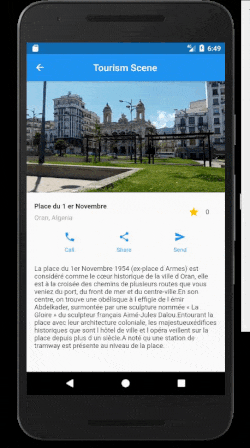
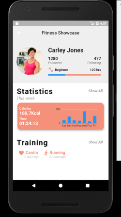

# Flutter Design Showcase

## Description:
These are the small pages and scenes i made while exploring flutter. After this, i decided to keep exploring flutter but in more profound ways which requires seperated projects.

## Tools & languages: 
* Android Studio (IDE).
* Dart (Logic & Design).
* Flutter (Mobile UI developement kit).
* Paint.Net (Image editting).

## Screenshots: 
 

 

## Contribution:
Feel free to `fork` this project and add whatever you like. If you have any suggestions or any comments please feel free to contact me or to open an issue, use free license art assets please.

## Team:
[Jetlighters](https://github.com/JetLightStudio) having fun.
